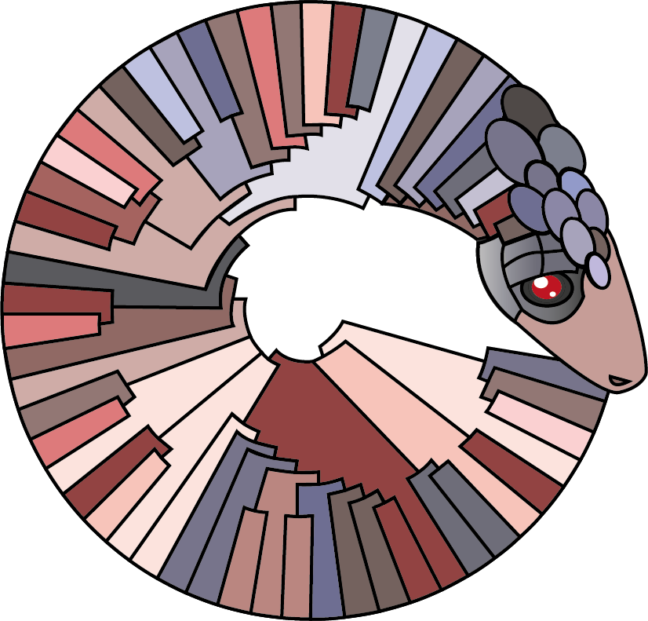

  <section id="banner">
    <div class="content">
      <header>
        <h1>pangolin</h1>
        <p>Phylogenetic Assignment of Named Global Outbreak Lineages</p>
      </header>
      <p><strong>pangolin</strong> assigns lineages to query sequences as described in Rambaut et al 2020.</p>
      <p><strong>pangolin</strong> is available as a command line tool and a web application. The web application was developed by the <a href="https://www.pathogensurveillance.net/">Centre for Genomic Pathogen Surveillance</a>. The command line tool is open source software available under the GNU General Public License v3.0.</p>
      <h3>Release notes:</h3>
      <p><strong>pangolin 2.0</strong> comes with major updates, including a significant speedup and assignment based on machine learning (affectionately described as pangoLEARN).</p>
    <p>
    <ul class="actions small">
        <a href="https://github.com/cov-lineages/pangolin" class="button special fit">Download pangolin 2.0</a>
    </ul>
    <ul class="actions small">
        <a href="http://pangolin.cog-uk.io/" class="button special fit">Assign lineages using pangolin web</a>
    </ul>
    </p>
    </div>
    <span class="image object">
      
    </span>
  </section>

<hr class="major" />

<div class="box">
    <h3>pangolin 2.0 release notes</h3>
    <p>This release of pangolin comes with some major changes, including a significant speed-up and improvements in assignment accuracy for larger lineages.  The new assignment algorithm (that we have termed pangoLEARN) is described in detail below.</p>
    <p>One significant benefit of this approach over the previous algorithm is that it allows us to incorporate all of the diversity of the large lineages into the assignment system rather than just picking a few representative sequences.</p>
    <p>We have pulled out informative sites and this information is included in the data release on <a href="https://github.com/cov-lineages/pangoLEARN/tree/master/pangoLEARN/supporting_information">pangoLEARN</a>. The top SNPs that are  most positively and negatively associated with a given lineage are detailed in those files. More details on this release and its practicalities can be found  <a href="https://github.com/cov-lineages/pangolin/releases/tag/v2.0">here</a>.</p>
</div>


<section id="banner">
    <div class="content">
      <h3>pangolin 2.0</h3>
      <p>pangoLEARN is an alternative algorithm for lineage assignment, which uses machine learning, implemented as of pangolin 2.0. This new algorithm, which relies on machine learning, offers much faster lineage assignment, as the phylogenetic approach was struggling to scale with the increase in number of lineages needing to be represented in the guide tree. This new approach also takes into account all of the diversity present within a lineage rather than just selecting a representative few. The consequences of this approach mean that for large lineages, we have improved our recall and precision significantly. We are continuing to develop more sophisticated approaches to machine learning for lineage assignment, which we hope will offer even better improvements in both speed and accuracy.</p>
    </div>
    <div class="image object">
        <span class="image object">
            
        </span>
    </div>
</section>
<section>
  <div class="row">
    <h3>pangoLEARN description</h3>
        <p>The current version of <strong>pangoLEARN</strong> uses a classification tree, but the pipeline has been written so that as more complex models are developed,the user will be able to choose which model to use to assign their lineages. The previous version of <strong>pangoLEARN</strong>  used multinomial logisitc regression, which is still available for download at the previous tagged release on GitHub.</p>
        <p>The model was trained using ~60,000 SARS-CoV-2 sequences from GISAID, acknowledgements <a href="./gisaid_acknowledgements.html">here</a>, with their lineages assigned by manually curating the global ML tree, as is the standard lineages data release procedure for <strong>pangolin</strong>. Each base of each genome was <a href="https://www.hackernoon.com/what-is-one-hot-encoding-why-and-when-do-you-have-to-use-it-e3c6186d008f">one-hot</a> encoded. This left us with a large number of parameters to train, which is why training this model takes approximately 30 minutes on our hardware (may change with different hardware). This model was built using the standard <a href="https://scikit-learn.org/stable/modules/generated/sklearn.tree.DecisionTreeClassifier.html">sci-kit learn implementation</a> of a decision tree learning algorithm. The code for this process is available in the <a href="https://github.com/cov-lineages/cov-support/blob/master/cov_support/scripts">cov-lineages/cov-support</a> repository.</p>
    </div>
</section>
<section>
  <div class="row">
    <div class="6u 12u$(small)">
        <h3>Multinomial logistic regression</h3>
        <p>While in standard regression a line of best fit is found for a set of training data, which represents a linear relationship between variables of interest, a logistic regression fits a <a href="https://en.wikipedia.org/wiki/Sigmoid_function">sigmoid function</a> to the training data, in order to tell two different classes apart. A multinomial logistic regression is an extension of a standard logistic regression in that it can be used to classify more than two classes. Each potential assignment (i.e. lineage) is modeled as a set of n-1 independent binary choices (sigmoid functions), where n is the number of classes.</p>
        <p> Multinomial logistic regression is an extremely commonly used model as it is able to simply and intuitively assign probabilities to class assignments. However, it does not incorporate any hierarchical structure. We are currently developing new models that do incorporate hierarchical structure. However, given the limitations of this simple model, it has performed surprisingly well with this data. While more complex models may offer improvements in assignment accuracies for smaller lineages, the logistic regression has the advantages of being intuitive, easy to implement, and relatively fast to train.</p>
    </div>
    <div class="6u$ 12u$(small)">
        <h3>Decision Trees</h3>
        <p>Decision trees are especially intuitive models. A series of if-then-else decision rules are learned from the input data and assembled into a hierarchical structure. The internal nodes represent a decision between a number of paths, and the leaf nodes represent a final classification. By learning this tree structure from data which itself comes from a phylogenic tree, we are representing this underlying phylogenic tree structure in a way which can be more easily harnessed for sequence classification.
        </p>
        <p>Decision trees can sometimes be thought of as brittle as small changes in the training data can potentially result in large changes in the tree structure. However, several similar model types were tested in preparation for this data release, including various Random Forest models, which are generally thought to be more robust than decision trees. The simpler decision tree performed the best both in terms of accuracy and training time. Because the older pieces of the underlying phylogenic tree structure will remain stable, this seems to be a case where the normal stability concerns associated with this model are less relevant.</p>
    </div>
  </div>
</section>

## pangolin: command line

### Requirements

<strong>pangolin</strong> runs on MacOS and Linux. The conda environment recipe may not build on Windows (I haven't tested it), but can be run using the Windows subsystem for Linux.

1. Some version of conda, we use Miniconda3. Can be downloaded from [here](https://docs.conda.io/en/latest/miniconda.html)
2. Your query fasta file

### Install pangolin

1. Clone this repository and ``cd pangolin``
2. ``conda env create -f environment.yml``
3. ``conda activate pangolin``
4. ``python setup.py install``
5. That's it

> Troubleshooting install see the [pangolin wiki](https://github.com/cov-lineages/pangolin/wiki)

<strong>Note</strong>: we recommend using pangolin in the conda environment specified in the ``environment.yml`` file as per the instructions above. If you can't use conda for some reason, bear in mind the data files are  hosted in two separate repositories at
- [<strong>cov-lineages/lineages</strong>](https://github.com/cov-lineages/lineages.git) 
- [<strong>cov-lineages/pangoLEARN</strong>](https://github.com/cov-lineages/pangoLEARN.git) <br>
you will need to pip install them alongside the other dependencies for pangolin (details found in [<strong>environment.yml</strong>](https://github.com/cov-lineages/pangolin/blob/master/environment.yml)).

### Check the install worked

Type (in the <strong>pangolin</strong> environment):

```
pangolin -v
pangolin -pv
pangolin -lv
```
and you should see the versions of <strong>pangolin</strong>, and <strong>pangoLEARN</strong> and <strong>lineages</strong> data release printed respectively.


### Updating pangolin

> Note: Even if you have previously installed <strong>pangolin</strong>, as it is being worked on intensively, we recommend you check for updates before running.

To update:

1. ``conda activate pangolin``
2. ``git pull`` \
pulls the latest changes from github
3. ``python setup.py install`` \
re-installs pangolin.
4. ``conda env update -f environment.yml`` \
updates the conda environment (you're unlikely to need to do this, but just in case!)
5. ``pip install git+https://github.com/cov-lineages/pangoLEARN.git --upgrade`` \
updates if there is a new data release
6. ``pip install git+https://github.com/cov-lineages/lineages.git --upgrade`` \
updates if there is a new data release, this is the legacy data repo and is unlikely to have tagged releases in the future

### Usage

1. Activate the environment ``conda activate pangolin``
2. Run ``pangolin <query>``, where ``<query>`` is the name of your input file


```
pangolin: Phylogenetic Assignment of Named Global Outbreak LINeages

positional arguments:
  query                 Query fasta file of sequences to analyse.

optional arguments:
  -h, --help            show this help message and exit
  -o OUTDIR,
  --outdir OUTDIR
                        Output directory. Default: current working directory
  --outfile OUTFILE     Optional output file name. Default: lineage_report.csv
  -d DATA, --data DATA  Data directory minimally containing a fasta alignment
                        and guide tree
  -n, --dry-run         Go through the motions but don't actually run
  --tempdir TEMPDIR     Specify where you want the temp stuff to go. Default:
                        $TMPDIR
  --no-temp             Output all intermediate files, for dev purposes.
  --max-ambig MAXAMBIG  Maximum proportion of Ns allowed for pangolin to
                        attempt assignment. Default: 0.5
  --min-length MINLEN   Minimum query length allowed for pangolin to attempt
                        assignment. Default: 10000
  --panGUIlin           Run web-app version of pangolin
  --assign-using-tree   LEGACY: Use original phylogenetic assignment methods
                        with guide tree. Note, will be significantly slower
                        than pangoLEARN
  --write-tree          Output a phylogeny for each query sequence placed in
                        the guide tree. Only works in combination with legacy
                        `--assign-using-tree`
  -t THREADS,
  --threads THREADS     Number of threads
  -p, --include-putative
                        Include the bleeding edge lineage definitions in
                        assignment
  --verbose             Print lots of stuff to screen
  -v, --version         show program's version number and exit
  -lv, --lineages-version
                        show lineages's version number and exit
  -pv, --pangoLEARN-version
                        show pangoLEARN's version number and exit
  ```


### Output

Your output will be a csv file with taxon name and lineage assigned, one line corresponding to each sequence in the fasta file provided

Example:

| Taxon       | Lineage   | support | pangoLEARN_version |status | note |
| ----------- |:---------:|:----------:| :----------:|:----------:| :----------:|
| Virus1      |  B.1      | 80       | 2020-04-27 | passed_qc    | |
| Virus2      |  A.1      |  65      | 2020-04-27 | passed_qc    | |
| Virus3      |  A.3      |  100     | 2020-04-27 | passed_qc    | |
| Virus4      |  B.1.4    |  82      | 2020-04-27 | passed_qc    | |
| Virus5      | None      | 0       | 2020-04-27 | fail    |   N_content:0.80 |
| Virus6      | None      | 0       | 2020-04-27 | fail    |   seq_len:0 |
| Virus7      | None      | 0       | 2020-04-27 | fail    |   failed to map |

Legacy phylogenetics output example:

| Taxon       | Lineage   | aLRT | UFbootstrap | lineages_version |status | note |
| ----------- |:---------:|:----------:|:----------:| :----------:|:----------:| :----------:|
| Virus1      |  B.1      | 80      |  82    | 2020-04-27 | passed_qc    | |
| Virus2      |  A.1      |  65     | 95     | 2020-04-27 | passed_qc    | |
| Virus3      |  A.3      |  100     | 100    | 2020-04-27 | passed_qc    | |
| Virus4      |  B.1.4    |  82     | 73     | 2020-04-27 | passed_qc    | |
| Virus5      | None      | 0       | 0       | 2020-04-27 | fail    |   N_content:0.80 |
| Virus6      | None      | 0       | 0       | 2020-04-27 | fail    |   seq_len:0 |

Resources for interpreting the aLRT and UFbootstrap output can be found [here](http://www.iqtree.org/doc/Tutorial#assessing-branch-supports-with-single-branch-tests) and [here](http://www.iqtree.org/doc/Command-Reference).


### Recall rate
<strong>Pre-pangolin 2.0:</strong>

Of 9,843 GISAID sequences assigned lineages by hand (taking sequence, phylogeny and metadata into account), pangolin accurately assigns the lineage of 97.85% of those sequences. Of the sequences that were not recalled correctly, 74.5% had 0 bootstrap and 0 alrt. We're continuing to work to improve this recall rate, but recommend interpreting the pangolin output cautiously with due attention to the UFbootstrap and aLRT values. 

Given SARS-CoV-2 is relatively slow evolving for an RNA virus and there is still not a huge amount of diversity, missing or ambiguous data at key residues may lead to incorrect placement within the guide tree. We have a filter in place that by default with not call a lineage for any sequence with >50% N-content, but this can be made more conservative with the command line option `--max-ambig`.

<strong>pangolin 2.0 onwards:</strong>

Recall and supporting statistics, hosted [here](https://github.com/cov-lineages/pangoLEARN/blob/master/pangoLEARN/data/lineagerecalls.txt), were generated using the same procedure as above to train a model using 75% of the data, while 25% of the data was used as testing data. Smaller lineages may have lower recall rates due to the very small sample sizes in the training and test set.

### SNPs associated with a given lineage

The model trains coefficients for each input parameter, for each potential lineage assignment. A particularly large coefficient in a particular lineage’s sigmoid function indicates a stronger association between that location and that lineage. A particularly negative coefficient in a particular lineage’s sigmoid function indicates the opposite. In other words, we can pick up SNPs that are strongly associated with or strongly negatively associated with a given lineage. This information is hosted for download from the [pangoLEARN](https://github.com/cov-lineages/pangoLEARN) data repository.


### Source data

<strong>pangolin</strong> runs a multinomial logistic regression model trained against lineage assignments based on GISAID data.

Legacy <strong>pangolin</strong> runs using a guide tree and alignment hosted at [<strong>cov-lineages/lineages</strong>](https://github.com/cov-lineages/lineages.git). Some of this data is sourced from GISAID, but anonymised and encrypted to fit with guidelines. Appropriate permissions have been given and acknowledgements for the teams that have worked to provide the original SARS-CoV-2 genome sequences to GISAID are also hosted [here](https://cov-lineages.org/gisaid_acknowledgements.html).

### Authors

<strong>pangolin</strong> was created by [Áine O'Toole](https://aineotoole.co.uk/), [JT McCrone](https://jtmccr1.github.io/) and [Emily Scher](http://www.scherscherscher.com/).
It uses lineages from [Rambaut et al. 2020](https://www.nature.com/articles/s41564-020-0770-5).

### Citing <strong>pangolin</strong>

There is a publication in prep for <strong>pangolin</strong>, but in the meantime please to link to this github [github.com/cov-lineages/pangolin](github.com/cov-lineages/pangolin) if you have used <strong>pangolin</strong> in your research. 


### References

The following external software is run as part of <strong>pangolin</strong>:

[iqtree](http://www.iqtree.org/#download)

L.-T. Nguyen, H.A. Schmidt, A. von Haeseler, B.Q. Minh (2015) IQ-TREE: A fast and effective stochastic algorithm for estimating maximum likelihood phylogenies.. Mol. Biol. Evol., 32:268-274. https://doi.org/10.1093/molbev/msu300

D.T. Hoang, O. Chernomor, A. von Haeseler, B.Q. Minh, L.S. Vinh (2018) UFBoot2: Improving the ultrafast bootstrap approximation. Mol. Biol. Evol., 35:518–522. https://doi.org/10.1093/molbev/msx281

Stéphane Guindon, Jean-François Dufayard, Vincent Lefort, Maria Anisimova, Wim Hordijk, Olivier Gascuel, New Algorithms and Methods to Estimate Maximum-Likelihood Phylogenies: Assessing the Performance of PhyML 3.0, Systematic Biology, Volume 59, Issue 3, May 2010, Pages 307–321, https://doi.org/10.1093/sysbio/syq010

[mafft](https://mafft.cbrc.jp/alignment/software/)

Katoh, Standley 2013 (Molecular Biology and Evolution 30:772-780)
MAFFT multiple sequence alignment software version 7: improvements in performance and usability.
(outlines version 7)


[minimap2](https://github.com/lh3/minimap2)

Heng Li, Minimap2: pairwise alignment for nucleotide sequences, Bioinformatics, Volume 34, Issue 18, 15 September 2018, Pages 3094–3100, https://doi.org/10.1093/bioinformatics/bty191

[snakemake](https://snakemake.readthedocs.io/en/stable/index.html)

Köster, Johannes and Rahmann, Sven. “Snakemake - A scalable bioinformatics workflow engine”. Bioinformatics 2012.
