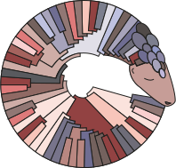
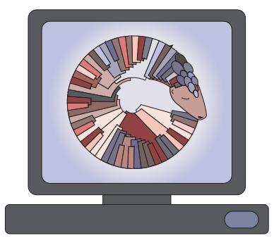

  <section>
    

      <header>
        <h1>pangolin</h1>
        
Phylogenetic Assignment of Named Global Outbreak Lineages

      </header>
      
pangolin was developed to implement the dynamic nomenclature of SARS-CoV-2 lineages, known as the Pango nomenclature. It allows a user to assign a SARS-CoV-2 genome sequence the most likely lineage (Pango lineage) to SARS-CoV-2 query sequences. 

    

  </section>
  <section>
    

        <article>
            
            <h3>Command-line tool</h3>
            
GNU General Public License v3.0

        </article>
        <article>
            
            <h3>Web application</h3>
            
Developed by the <a href="https://www.pathogensurveillance.net/">Centre for Genomic Pathogen Surveillance.</a>
            

        </article>
      

    </section>

### QUICK LINKS

<section>

  

    <ul>
      <li><a href="{{ 'pangolin_docs/pangolearn.html' | absolute_url }}">How it works</a></li>
      <li><a href="{{ 'pangolin_docs/pangolearn.html' | absolute_url }}">Model training</a></li>
      <li><a href="{{ 'pangolin_tutorial.html' | absolute_url }}">pangolin tutorial</a></li>
    </ul>
  

  

    <ul>
      <li><a href="{{ 'pangolin_docs/requirements.html' | absolute_url }}">Dependencies</a></li>
      <li><a href="{{ 'pangolin_docs/installation.html' | absolute_url }}">Installation</a></li>
      <li><a href="{{ 'pangolin_docs/updating.html' | absolute_url }}">Updating</a></li>
    </ul>
  

  

    <ul>
      <li><a href="{{ 'pangolin_docs/usage.html' | absolute_url }}">Usage</a></li>
      <li><a href="{{ 'pangolin_docs/output.html' | absolute_url }}">Output</a></li>
      <li><a href="{{ 'contributors.html' | absolute_url }}">Citing pangolin</a></li>
    </ul>
  

</section>

