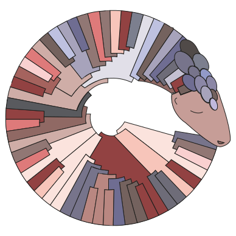

<section id="banner">
    

      <header>
        <h2>pangolin web app tutorial</h2>
        
Assigning SARS-CoV-2 lineages with pangolin

      </header>
      
<strong>pangolin</strong> assigns lineages to query sequences as described in Rambaut et al 2020.

      
<strong>pangolin</strong> is available as a command line tool and a web application. The web application was developed by the <a href="https://www.pathogensurveillance.net/">Centre for Genomic Pathogen Surveillance</a>. The command line tool is open source software available under the GNU General Public License v3.0.

      
        
        
    

    
      
    
</section>

### Sample data

Download example sequence data:
<a href="assets/data/cluster.fasta" download>cluster.fasta</a>

Download accompanying sample metadata:
<a href="assets/data/cluster.csv" download>cluster.csv</a>

### Upload the sample data

Navigate to <a href="https://pangolin.cog-uk.io/">pangolin.cog-uk.io</a> to the home screen of the pangolin web application.

From this screen you can drag and drop a fasta file containing one or more SARS-CoV-2 sequences to upload your sequences into pangolin. Note that the sequence names are anonymised and no identifying information is stored, however uploading to pangolin does mean your sequences will be analysed on a remote server. 

Once your sequences have uploaded you'll see the following screen
meaning the sequences are ready for analysis. 

### Start analysis

Click on the "Start analysis" button to begin running pangolin. Your sequences will be assigned their most likely lineage based on the most recent pangoLEARN machine learning model.  

### Failed sequences

Occasionally sequences will "fail" to be analysed for QC reasons. Select the exclamation mark (!) to see more information about why a sample failed. Reasons for failure may be:
- A sequence may have too high N content
- It may be too short
- It may be too diverged from SARS-CoV-2 

### Button descriptions

Play around with the results on the screen, pressing the tick button will give you more information about the lineage and clicking on the map buttons will link out to Microreact, a web-visualisation tool that has been adapted to display SARS-CoV-2 lineages. 

### Microreact 

A great instructional video showcasing microreact can be found <a href="https://microreact.org/showcase">here</a>. 

Click on the Globe icon next to one of the sequences that have been assigned lineage B. You should see the variety of panels in the microreact web app, including a map showing the global spread of lineage B (upper left), where lineage B lies on the global tree (upper right) and sequence counts over time (lower panel). All panels are interactive and displays can be customised by clicking the upper right logo on each panel.

Next return to the pangolin results page and link out to microreact for the other lineage, B.1.1.65. Notice this lineage is much smaller and much more geographically confined.

### Take homes
- It's very simple to use the web app to assign lineages with pangolin
- Some lineages are very large and geographically widespread
- Some lineages may only have a handful of sequences and be limited to a single location
- Microreact summarises the most up to date data from COG-UK, displaying pangolin lineages 

